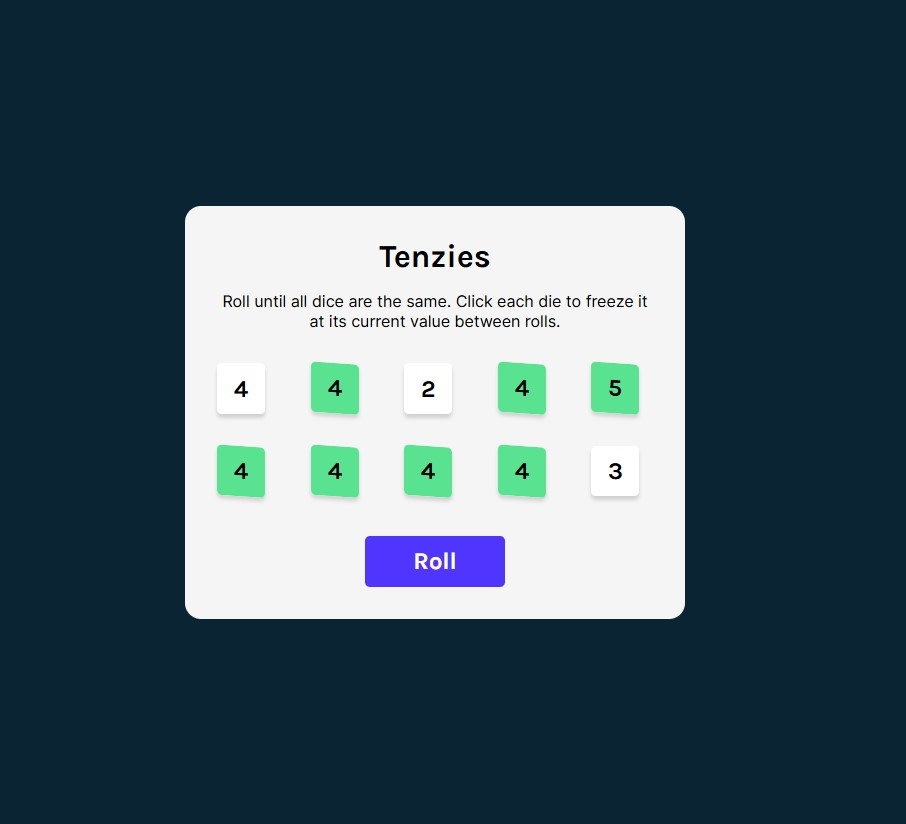
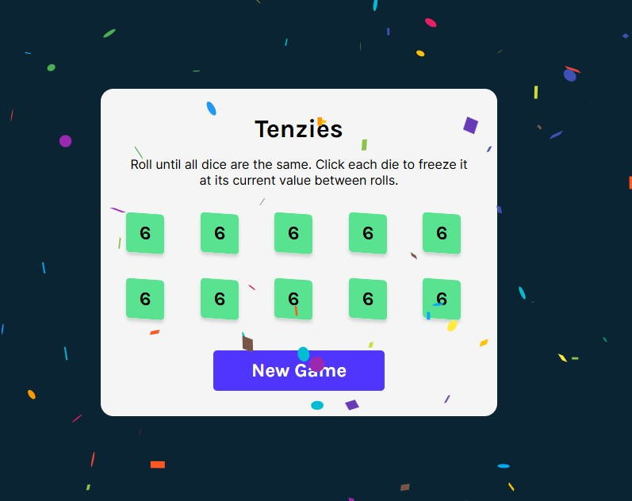

# Tenzies Game Section 4 Project {React Course, Scrimba}

This is a solution to the [Tenzies Game project Section 4 React Course](https://scrimba.com/playlist/pYkgpAP).
The course is offered for FREE on Scrimba by Bob Ziroll [Learn React](https://scrimba.com/learn/learnreact)(An amazing tutor -- really understood his course)

I decided to show my travel experience in Watamu, Kenya. I visited this place after completing my 4th Year studies in Uni

## Table of contents

- [Tenzies Game Section 4 Project {React Course, Scrimba}](#tenzies-game-section-4-project-react-course-scrimba)
  - [Table of contents](#table-of-contents)
  - [Overview](#overview)
    - [The challenge](#the-challenge)
    - [Screenshot](#screenshot)
    - [Links](#links)
  - [My process](#my-process)
    - [Built with](#built-with)
    - [What I learned](#what-i-learned)
    - [Continued development](#continued-development)
  - [Author](#author)

## Overview

### The challenge

Requirements : -

Recreate the tenzies game site from the figma file shared

### Screenshot

Screenshot of the Tenzies Game mock up



### Links

- Solution URL: [GitHub Link](https://github.com/Javascript30/Tenzies.git)
- Live Site URL: [Netlify Deploy](https://Memeleskim.netlify.app/)

## My process

1. Recreated the design as per [Figma](https://www.figma.com/file/FqsxRUhAaXM4ezddQK0CdR/Tenzies?t=x9dXpAPbXuK7Yl3h-0)

2. Started with the mockup -- deleteting unrequired files and adding the `component` and `images` files to the structure after `npm create vite@latest tenzies -- --template react`

3. Started with the `App` section using a main to set __the container for the game__ and styled it accordingly

4. Then created the `Die` **component** as a button element for the various dice 
   
5. Mapped out the dices in `App` using `props` as needed for manipulating the `held` state and die values as required  
   

6. Added the `Confetti` package on a game win 
   
   

7. Writing out this `README.md` file

### Built with

- React
- JSX syntax
- Semantic HTML5 markup
- CSS custom properties
- Grid

### What I learned

- Using Figma files to code

- ##### ES6 Function call VS Normal fxn call

```JSX

  const [dices, setDices] = React.useState(allNewDice());
// This has no error when state needs to be innitilaized with the allNewDice() fxn
 function allNewDice() {
    let newArray = [];
    for (let i = 0; i < 10; i++) {
      newArray.push({
        value: randomDice(),
        isHeld: false,
        id: uuidv4(),
      });
    }
    return newArray;
  }
// This has an error when state needs to be innitilaized with the allNewDice() fxn
  
  const allNewDice = () =>  {
    let newArray = [];
    for (let i = 0; i < 10; i++) {
      newArray.push({
        value: randomDice(),
        isHeld: false,
        id: uuidv4(),
      });
    }
    return newArray;
  }
```

- ##### Styling an element conditionally

```JSX

const heldColor = {
    backgroundColor: props.isHeld ? "var(--green)" : "var(--white)",
    transform: props.isHeld && "skewY(4deg)",
  };

```

- ##### Using uuid package for keys and Dynamic functian calls as a prop 

```JSX

import { v4 as uuidv4 } from "uuid";

newArray.push({
        value: randomDice(),
        id: uuidv4(),
      });
<Die
      key={dice.id}
      holdDice={() => holdDice(dice.id)}
    />
```

- ##### Using useEffects to know if the game has been won

```jsx

React.useEffect(() => {
    // Check if all the dices are being held and have same value
    if (
      dices.every((dice) => dice.isHeld) &&
      dices.every((dice) => dice.value === dices[0].value)
    ) {
      setTenzies(!tenzies);
      console.log("You won");
    }
  }, [dices]);

```

- ##### React! React! React!

### Continued development

- Learning more React! (yeah reenacting React problems and tackling them)

- Better turnaround time -- simple stuff but worked on it for a while

- Less Code (code cleanup)

## Author

- Website - [Lesley Kimutai](https://leskim.github.io/myweb/)
- Frontend Mentor - [Frontend Mentor](https://www.frontendmentor.io/profile/Leskim)
